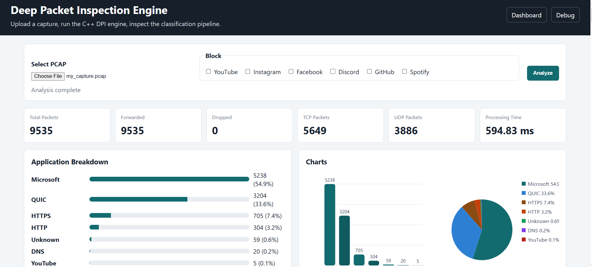
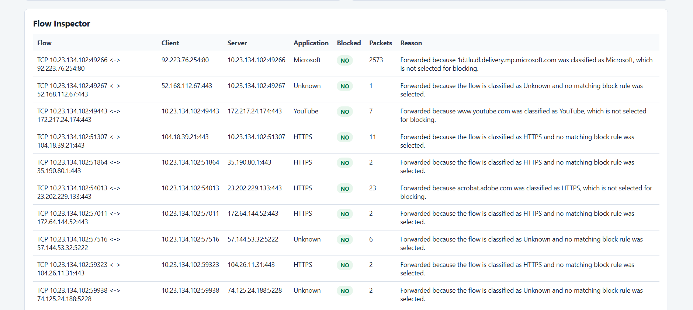
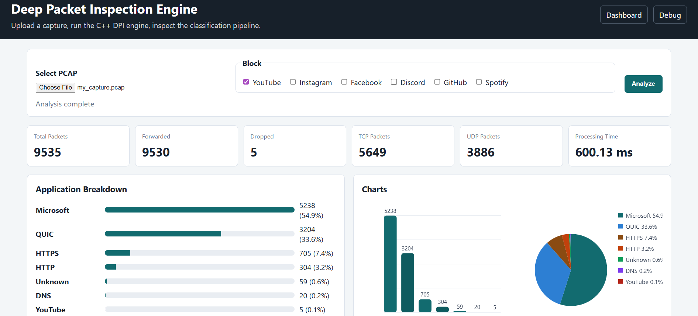
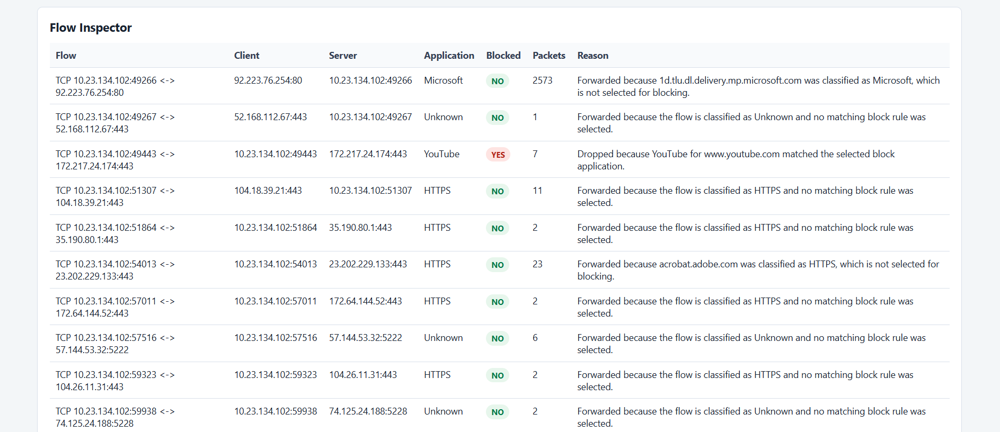
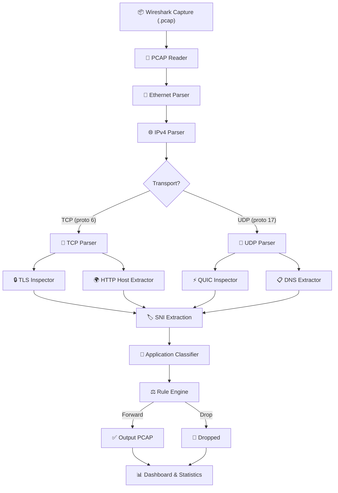
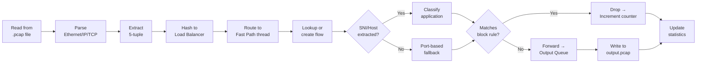
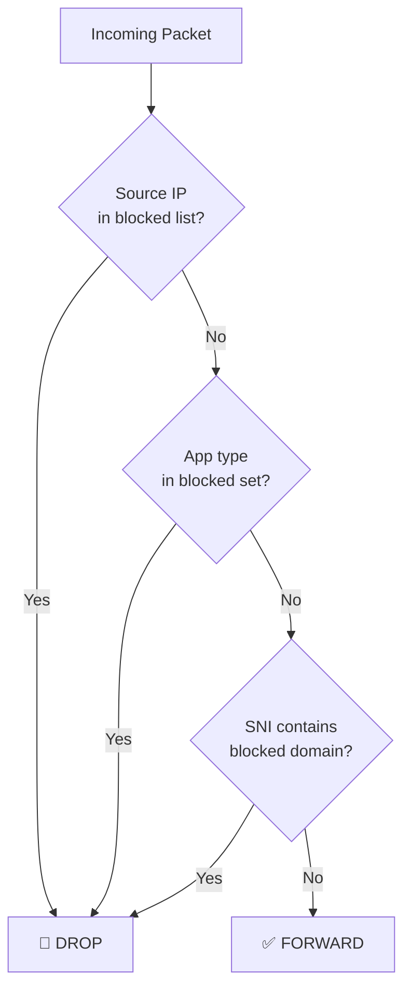
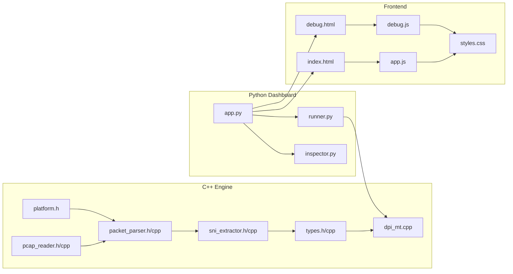

<h1 align="center">Deep Packet Inspection Engine</h1>

<p align="center">
  <b>A multi-threaded network traffic analyzer and application-level firewall written in C++17</b><br>
  <sub>Classify encrypted traffic · Block applications by name · Visualize everything</sub>
</p>

<p align="center">
  
  
  
  
  
</p>

---

## The Invisible Gatekeeper

Have you ever wondered how your internet provider knows what you're trying to access?

Why does a website suddenly stop working the moment your data plan expires — while everything else keeps loading? How can a university block social media during exams while still allowing educational websites? How can an office network prevent employees from opening entertainment platforms without reading the actual content of their communication?

At first glance, it almost feels like magic.

Modern internet communication is encrypted. When you open YouTube, your browser wraps the request in layers of TLS encryption before it ever touches the wire. Nobody sitting between you and YouTube — not your router, not your ISP, not the campus firewall — can simply read the conversation and figure out what video you're watching.

So if nobody can read the content, how can these systems still recognize YouTube, GitHub, Discord, or Spotify?

Here's the thing:

> **Sometimes a system does not need to know *what* you are saying. It only needs to understand *where* you are trying to go.**

Before encryption kicks in, every connection leaks a small but critical piece of information — the **Server Name Indication (SNI)**. It's the digital equivalent of writing a destination address on a sealed envelope. The letter inside is private, but the postal system still needs to know where to deliver it.

This single metadata field is enough. Enough to classify traffic, enforce policy, and make intelligent forwarding decisions — all without breaking the encryption, all without violating privacy.

---

## Why This Problem Exists

The internet was not designed with application-level visibility in mind. IP addresses identify machines, not services. Port numbers suggest protocols, but a single server at `142.250.80.46` might host Google Search, YouTube, Gmail, and Google Drive simultaneously — all on port `443`.

Traditional firewalls operate at layers 3 and 4: they can block an IP or a port. But blocking the IP for YouTube means blocking every Google service hosted on the same infrastructure. Blocking port `443` means killing all HTTPS traffic entirely.

The gap between what traditional firewalls see and what network administrators need to control created the field of **Deep Packet Inspection** — analyzing packets beyond their headers to extract application-level context.

## Why Solving This Matters

Every enterprise firewall, every parental control system, every ISP content filter, and every government-level censorship appliance relies on some variant of this technique. The concepts implemented here aren't academic exercises — they're the foundation of products built by Palo Alto Networks, Cisco, Fortinet, and Cloudflare.

Understanding how DPI works means understanding how the modern internet is actually controlled.

---

## What This Project Is

This repository is an educational, end-to-end implementation of a Deep Packet Inspection engine. It reads real network captures, parses packets down to the byte, extracts hostnames from encrypted TLS and QUIC handshakes, classifies traffic into named applications, enforces blocking rules, and outputs a filtered capture — all from scratch, with no external networking libraries.

It combines:
- **Systems programming** — raw binary parsing in C++17 with manual byte-order handling
- **Protocol analysis** — Ethernet, IPv4, TCP, UDP, TLS 1.2/1.3, QUIC, DNS, HTTP
- **Concurrent architecture** — multi-threaded pipeline with lock-free queues and flow-pinned load balancing
- **Rule engine** — blocking by application name, IP address, or domain substring
- **Visualization** — a Flask-based dashboard with real-time charts, packet search, and per-flow decision explanations

---

## High-Level Solution

```
┌──────────────────────────────────────────────────────────────┐
│                     PCAP Capture File                        │
│              (real traffic from Wireshark)                   │
└────────────────────────┬─────────────────────────────────────┘
                         │
                         ▼
┌──────────────────────────────────────────────────────────────┐
│                   C++ DPI Engine                             │
│  ┌──────────┐  ┌──────────┐  ┌───────────┐  ┌───────────┐  │
│  │  Parser  │→ │ Classify │→ │Rule Engine│→ │  Output   │  │
│  └──────────┘  └──────────┘  └───────────┘  └───────────┘  │
└────────────────────────┬─────────────────────────────────────┘
                         │
                         ▼
┌──────────────────────────────────────────────────────────────┐
│                  Flask Dashboard                             │
│   Statistics · Charts · Packet Search · Flow Inspector       │
└──────────────────────────────────────────────────────────────┘
```

The engine doesn't sniff live traffic. It processes `.pcap` files — the standard format used by Wireshark, tcpdump, and every serious network analysis tool. This makes the project fully reproducible: capture once, analyze many times, compare results with and without blocking rules.

---

## Demo

### Step 1 — Analyze Without Blocking

The user uploads a Wireshark capture and clicks **Analyze**. No blocking rules are selected. The dashboard processes all 9,535 packets and shows the full application breakdown: Microsoft traffic dominates at 54.9%, QUIC takes 33.6%, followed by HTTPS, HTTP, and a small slice of YouTube.

Notice the **Dropped** counter reads **0**. Every packet passed through.



### Step 2 — Inspect Flows Before Blocking

Navigate to **Debug → Flow Inspector**. Each row represents a bidirectional connection. The YouTube flow (`10.23.134.102 ↔ 172.217.24.174:443`) is clearly visible — classified as YouTube, 7 packets, **Blocked: NO**.

The Reason column explains *why* each decision was made: *"Forwarded because www.youtube.com was classified as YouTube, which is not selected for blocking."*



### Step 3 — Enable YouTube Blocking

Check the **YouTube** checkbox in the Block panel. Click **Analyze** again. The same capture, the same packets — but now the engine knows to drop anything classified as YouTube.

The **Dropped** counter jumps to **5**. Forwarded drops from 9,535 to 9,530. The engine identified every packet belonging to YouTube flows and excluded them from the generated output PCAP.



### Step 4 — Verify in Flow Inspector

Return to **Debug → Flow Inspector**. The YouTube flow now shows **Blocked: YES**. The Reason reads: *"Dropped because YouTube for www.youtube.com matched the selected block application."*

Every other flow remains untouched. The rule engine surgically removed only the targeted traffic.



---

## How It Works Internally

### System Architecture

Every packet passes through a layered parsing pipeline. Each stage extracts information from a specific protocol layer and passes structured data to the next.



### What Each Stage Does

| Stage | Input | Output | Key Detail |
|-------|-------|--------|------------|
| **PCAP Reader** | Binary file | Raw packet bytes + timestamps | Handles both little-endian and big-endian PCAP formats via magic number detection |
| **Ethernet Parser** | Raw bytes | MAC addresses, EtherType | Extracts 14-byte Ethernet II header; filters for IPv4 (`0x0800`) |
| **IPv4 Parser** | Ethernet payload | Source/dest IP, protocol, TTL | Handles variable-length headers (IHL field), network byte-order conversion |
| **TCP Parser** | IP payload | Ports, flags, sequence numbers | Computes data offset from 4-bit field to locate application payload |
| **UDP Parser** | IP payload | Ports, length | Fixed 8-byte header, payload starts immediately after |
| **TLS Inspector** | TCP payload on port 443 | Client Hello detection | Validates Content Type `0x16`, Handshake Type `0x01`, TLS version range |
| **QUIC Inspector** | UDP payload on port 443 | Initial packet detection | Checks long-header form bit (`0x80`), scans for embedded TLS Client Hello |
| **SNI Extractor** | TLS Client Hello | Hostname string | Walks past Random (32B), Session ID, Cipher Suites, Compression to reach Extensions; finds type `0x0000` |
| **HTTP Host Extractor** | TCP payload on port 80 | Hostname string | Pattern-matches HTTP methods, extracts `Host:` header value |
| **DNS Extractor** | UDP payload on port 53 | Queried domain | Parses label-length encoding of DNS question section |
| **Application Classifier** | Hostname/SNI | `AppType` enum | Substring matching against curated pattern lists for 17+ applications |
| **Rule Engine** | App type, SNI, source IP | Forward or Drop | Checks against blocked IPs, blocked app types, and blocked domain substrings |

---

### Packet Processing Pipeline

This is the journey of a single packet through the engine — from raw bytes on disk to a forwarding decision.



### The Five-Tuple and Flow Tracking

The engine doesn't evaluate each packet in isolation. It groups packets into **flows** using the five-tuple:

```
┌───────────────────────────────────────────────┐
│              Five-Tuple (Flow Key)            │
├───────────────┬───────────────────────────────┤
│  Source IP     │  10.23.134.102               │
│  Dest IP       │  172.217.24.174              │
│  Source Port   │  49443                        │
│  Dest Port     │  443                          │
│  Protocol      │  TCP (6)                      │
└───────────────┴───────────────────────────────┘
```

Both directions of the same connection are **canonicalized** into one flow entry. If packet A→B has already been classified as YouTube, packet B→A inherits the same classification and the same blocking decision — no redundant SNI extraction needed.

---

### Blocking Engine

The rule engine supports three blocking dimensions, evaluated in order:



| Rule Type | Example | Matching Logic |
|-----------|---------|----------------|
| **Block IP** | `--block-ip 192.168.1.50` | Exact match on source IP |
| **Block App** | `--block-app YouTube` | Enum comparison after classification |
| **Block Domain** | `--block-domain tiktok` | Substring match on extracted SNI |

Once a flow is marked as blocked, every subsequent packet on that flow is dropped without re-evaluation.

---

### Multi-Threaded Architecture

The engine uses a **Reader → Load Balancer → Fast Path → Output** pipeline, designed to keep flow state local to individual threads.

```
                         ┌──────────────┐
                    ┌───→│   Fast Path 0 │───┐
┌────────┐   ┌─────┤    └──────────────┘    │    ┌──────────┐
│        │   │ LB0 │    ┌──────────────┐    ├───→│          │
│ Reader │──→│     ├───→│   Fast Path 1 │───┤    │  Output  │
│        │   └─────┘    └──────────────┘    │    │  Writer  │
│        │   ┌─────┐    ┌──────────────┐    │    │          │
│        │──→│     ├───→│   Fast Path 2 │───┤    └──────────┘
│        │   │ LB1 │    └──────────────┘    │
└────────┘   │     │    ┌──────────────┐    │
             └─────┤───→│   Fast Path 3 │───┘
                   │    └──────────────┘
                   └────────────────────
```

| Component | Count | Role |
|-----------|-------|------|
| **Reader** | 1 | Reads packets from PCAP, parses headers, dispatches to Load Balancers |
| **Load Balancers** | 2 (default) | Hash the five-tuple to select a Fast Path thread — ensures all packets from the same connection hit the same thread |
| **Fast Path** | 4 (default, 2 per LB) | Owns a private flow table. Performs classification, rule checking, and forwards/drops. No locks on the flow table — each FP is single-owner |
| **Output Writer** | 1 | Drains the output queue and writes forwarded packets to the output PCAP |

The key design decision: **flow-pinned hashing**. By routing all packets of the same connection to the same Fast Path thread, each thread can maintain its flow table without locks. The `FiveTupleHash` uses a direction-independent canonicalization so that packets from A→B and B→A hash identically.

---

## Source Code Architecture



### Module Responsibilities

| Module | Language | Lines | Purpose |
|--------|----------|-------|---------|
| `dpi_mt.cpp` | C++ | ~780 | Multi-threaded engine: queues, load balancers, fast path processors, rule engine, statistics, PCAP output |
| `packet_parser.cpp` | C++ | ~190 | Ethernet/IPv4/TCP/UDP header parsing with network byte-order conversion |
| `sni_extractor.cpp` | C++ | ~300 | TLS Client Hello SNI extraction, QUIC Initial scanning, HTTP Host extraction, DNS query parsing |
| `types.cpp` | C++ | ~310 | Five-tuple canonicalization, application classifier with 17+ app patterns |
| `pcap_reader.cpp` | C++ | ~110 | PCAP file format reader with endianness auto-detection |
| `platform.h` | C++ | ~60 | Portable byte-order conversion (no platform-specific headers) |
| `app.py` | Python | ~120 | Flask routes: upload, analyze, download, results API |
| `runner.py` | Python | ~110 | Subprocess invocation of `dpi_engine.exe`, stdout parsing |
| `inspector.py` | Python | ~310 | Pure-Python PCAP parser for per-packet, per-flow, DNS, and QUIC inspection |
| `app.js` | JS | ~230 | Dashboard rendering: stats, bar/pie charts (canvas), tables, search |
| `debug.js` | JS | ~70 | Debug page: packet pipeline, DNS inspector, QUIC inspector, flow inspector |

---

## Folder Structure

```
Packet_analyzer/
│
├── include/                    # C++ headers
│   ├── packet_parser.h         #   Ethernet/IPv4/TCP/UDP structures
│   ├── pcap_reader.h           #   PCAP file format structures
│   ├── sni_extractor.h         #   TLS/QUIC/HTTP/DNS extractors
│   ├── types.h                 #   Five-tuple, AppType, flow state, stats
│   └── platform.h              #   Portable byte-order utilities
│
├── src/                        # C++ implementation
│   ├── dpi_mt.cpp              #   Multi-threaded DPI engine (main)
│   ├── main.cpp                #   Standalone packet analyzer (CLI)
│   ├── packet_parser.cpp       #   Protocol parsing implementation
│   ├── pcap_reader.cpp         #   PCAP reader implementation
│   ├── sni_extractor.cpp       #   SNI/Host/DNS extraction
│   └── types.cpp               #   App classification logic
│
├── dashboard/                  # Python web dashboard
│   ├── app.py                  #   Flask application factory
│   ├── runner.py               #   C++ engine subprocess wrapper
│   ├── inspector.py            #   Pure-Python PCAP analysis
│   ├── templates/
│   │   ├── index.html          #   Main dashboard page
│   │   └── debug.html          #   Flow/packet/DNS inspector
│   └── static/
│       ├── app.js              #   Dashboard logic & charts
│       ├── debug.js            #   Debug page logic
│       └── styles.css          #   UI styles
│
├── samples/
│   └── sample_capture.pcap     #   Pre-included test capture
│
├── scripts/
│   └── generate_sample_pcap.py #   Generate synthetic PCAP for testing
│
├── assets/                     #   Dashboard screenshots
│   ├── 1.png                   #   Analysis without blocking
│   ├── 2.png                   #   Flow inspector (before)
│   ├── 3.png                   #   Analysis with YouTube blocked
│   └── 4.png                   #   Flow inspector (after)
│
├── requirements.txt            #   Python dependencies (Flask)
├── WINDOWS_SETUP.md            #   Detailed Windows build guide
└── dpi_engine.exe              #   Pre-built engine binary
```

---

## Technology Stack

| Technology | Role | Why This Was Chosen |
|-----------|------|---------------------|
| **C++17** | DPI Engine | Packet parsing demands direct memory access and byte-level control. C++ provides zero-cost abstractions over raw buffers, deterministic memory management, and native threading primitives. `std::optional`, structured bindings, and `if constexpr` from C++17 make the code both safe and expressive. |
| **Flask** | Dashboard backend | The dashboard needs a thin HTTP layer to receive uploads, invoke the C++ engine, and serve JSON. Flask does exactly that without imposing structure the project doesn't need. No ORM, no middleware stack, no configuration files — just routes and functions. |
| **HTML / CSS / JS** | Dashboard frontend | Vanilla JavaScript with Canvas API for charts avoids the dependency overhead of React/Vue for what is fundamentally a single-page data display. Every chart is drawn pixel-by-pixel — no Chart.js, no D3 — which keeps the frontend at three files total. |
| **Wireshark / PCAP** | Capture format | PCAP is the universal packet capture format. By reading `.pcap` files, the engine works with captures from Wireshark, tcpdump, tshark, or any network tap. Wireshark itself is only needed for *capturing* traffic — not for running the project. |
| **CMake / g++ / cl** | Build system | The engine compiles as a single invocation of `g++` or `cl` with no external dependencies. CMake is available for IDE integration but isn't required. This was a deliberate choice: zero dependency hell, compiles anywhere a C++17 compiler exists. |

---

## Running the Project

### Prerequisites

- **C++17 compiler** — g++ (MinGW/MSYS2), cl (Visual Studio), or g++ (WSL/Linux)
- **Python 3.10+** with `flask` installed

### Build the Engine

```bash
# MinGW / Linux
g++ -std=c++17 -O2 -pthread -I include -o dpi_engine.exe \
    src/dpi_mt.cpp src/pcap_reader.cpp src/packet_parser.cpp \
    src/sni_extractor.cpp src/types.cpp

# Visual Studio (Developer Command Prompt)
cl /EHsc /std:c++17 /O2 /I include /Fe:dpi_engine.exe ^
    src\dpi_mt.cpp src\pcap_reader.cpp src\packet_parser.cpp ^
    src\sni_extractor.cpp src\types.cpp
```

### Launch the Dashboard

```bash
pip install -r requirements.txt
python -m flask --app dashboard.app run --debug
```

Open `http://127.0.0.1:5000` in your browser.

### CLI Usage

```bash
# Basic analysis
./dpi_engine.exe capture.pcap output.pcap

# Block YouTube and a specific IP
./dpi_engine.exe capture.pcap filtered.pcap --block-app YouTube --block-ip 192.168.1.50

# Custom thread configuration
./dpi_engine.exe capture.pcap output.pcap --lbs 4 --fps 4
```

> 📘 For detailed Windows setup instructions (Visual Studio, MinGW, WSL, VS Code), see [WINDOWS_SETUP.md](WINDOWS_SETUP.md).

---

## Sample Capture

The repository ships with a ready-to-use sample capture at `samples/sample_capture.pcap`. You don't need Wireshark installed. You don't need to capture your own traffic. You don't need any special hardware or network access.

```
Clone repository
       │
       ▼
Launch dashboard
       │
       ▼
Upload sample_capture.pcap
       │
       ▼
Click Analyze
       │
       ▼
Observe application classification
       │
       ▼
Enable YouTube blocking
       │
       ▼
Click Analyze again
       │
       ▼
Compare results
```

This is one of the biggest strengths of the project: **everything needed to evaluate the full pipeline is already in the box.** Clone, build, launch, upload, and you're looking at classified network traffic within a minute.

---

## Dashboard Features

| Feature | Description |
|---------|-------------|
| **Statistics Panel** | Total packets, forwarded, dropped, TCP/UDP breakdown, processing time |
| **Application Breakdown** | Horizontal bar chart with percentage for each detected application |
| **Charts** | Canvas-rendered bar chart and pie chart — no external charting library |
| **Detected Domains** | Sortable, searchable table of all extracted hostnames and their classifications |
| **Packet Search** | Filter packets by hostname, application, or decision |
| **Block Summary** | Shows which apps were blocked, how many packets were removed, and how many remain |
| **Output Download** | Download the filtered `.pcap` and the full `analysis.json` |
| **Live Log** | Raw engine output displayed in real-time |
| **Debug: Packet Pipeline** | Per-packet view showing protocol, hostname, SNI status, app, blocked status, and reasoning |
| **Debug: DNS Inspector** | Every DNS query/response with its classification and blocking decision |
| **Debug: QUIC Inspector** | QUIC Initial packets with extracted SNIs and flow associations |
| **Debug: Flow Inspector** | Bidirectional flow table with client/server, application, packet count, and per-flow reasoning |

---

## Future Enhancements

| Enhancement | Complexity | Impact |
|-------------|------------|--------|
| IPv6 support | Medium | Currently only IPv4; IPv6 parsing would extend coverage to dual-stack networks |
| Live capture mode | High | Replace file-based input with libpcap/npcap for real-time packet sniffing |
| Encrypted Client Hello (ECH) detection | High | ECH hides the SNI field; would require ESNI fallback heuristics |
| Connection-level state machine | Medium | Track TCP SYN/SYN-ACK/FIN to report connection lifecycle, not just packet counts |
| YAML/JSON rule configuration | Low | Replace CLI flags with a structured rule file for complex policies |
| Persistent flow database | Medium | Store historical analysis results for trend comparison across captures |
| WebSocket live updates | Medium | Stream classification results to the dashboard as packets are processed |
| Extended QUIC parsing | High | Full QUIC frame parsing instead of TLS pattern scanning within the payload |

---

## What Building This Teaches

Building a DPI engine from scratch isn't about writing a packet sniffer. It's about understanding the full vertical stack:

- **Binary protocols** — Reading a TLS Client Hello means manually counting bytes past the Random field (32 bytes), past the variable-length Session ID, past the variable-length Cipher Suites, past the Compression Methods, into the Extensions — and then walking each extension until you find type `0x0000`.

- **Endianness** — Network byte order is big-endian. x86 is little-endian. Every multi-byte field in every header needs conversion. The `platform.h` module provides portable swaps without relying on OS-specific headers.

- **Concurrent systems design** — The multi-threaded pipeline isn't parallel for performance alone. It demonstrates flow-pinned hashing: a design pattern used by real network appliances to keep per-connection state local to a single core, eliminating lock contention on the hot path.

- **Protocol layering** — Ethernet wraps IP wraps TCP wraps TLS wraps the application. Each layer has a variable-length header. Parsing requires computing offsets dynamically: the IP header length is encoded in 4 bits, the TCP data offset in another 4 bits, and the payload starts at the sum of all preceding lengths.

- **The metadata paradox** — Even with end-to-end encryption, networks leak enough metadata to enable remarkably precise application classification. Understanding this is fundamental to understanding internet privacy, censorship resistance, and network security.

---

## Closing

We started with a question: if modern internet traffic is encrypted, how can any system between you and your destination know where you're going?

The answer is that encryption protects content, not context. The destination address is exposed before the secure channel is established — in the TLS handshake, in the DNS query, in the QUIC Initial packet. Every firewall, every content filter, every traffic shaping device in the world exploits this same window of visibility.

This repository demonstrates that idea through a complete implementation — from reading raw bytes off a PCAP file, through multi-layered protocol parsing, through SNI extraction and application classification, through a rule engine that makes forwarding decisions, all the way to a visual dashboard that explains every decision the system made and why.

It isn't just a packet parser. It's a systems programming project, a protocol analysis tool, a concurrent pipeline, a rule engine, and a full-stack web application — built end to end.

---

<p align="center">
  <sub>Built with care as a demonstration of systems engineering, protocol analysis, and software architecture.</sub>
</p>
